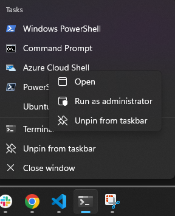

Copyright (c) 2023 Intercreate, Inc. 

# Summary

This guide provides instructions for setting up an environment for developing, debugging, and programming embedded systems firmware in Windows.

# Table of Contents

- [Dependencies](#dependencies)
- [Recommended Tools](#recommended-tools)
- [Revision History](#revision-history)

# Dependencies

This section should be completed in order.

## Required Dependecies

### Windows 11

Windows 10 has announced end of support on 2025-10-14.

[Installation Documentation](https://support.microsoft.com/en-us/windows/ways-to-install-windows-11-e0edbbfb-cfc5-4011-868b-2ce77ac7c70e)

---

### Windows Terminal

If you don't have Windows Terminal yet, you'll need to use PowerShell to install it.  After this, Windows Terminal is your interface to PowerShell.

```powershell
winget install --id Microsoft.WindowsTerminal -e
```

#### Configuration

- Pin Terminal to the taskbar.
- Open Terminal as administrator and [allow local PS scripts to run](https://learn.microsoft.com/en-us/powershell/module/microsoft.powershell.core/about/about_execution_policies?view=powershell-7.3#remotesigned):
  
  

  ```powershell
  Set-ExecutionPolicy RemoteSigned
  ```
- In Windows Terminal, increase your history size.
  - Press `Ctrl Shift ,` to open your Windows Terminal [settings.json](https://learn.microsoft.com/en-us/windows/terminal/install#settings-json-file)
  - Under the top level field `"profiles"`, find the `"defaults"` field or create it.
  - Edit the `"defaults"` object to have `"historySize": 100000` (though apparently 32767 is max), for example:
    ```json
    "defaults": 
    {
        "historySize": 100000
    },
    ```
  - Optionally turn off the bell.
    ```json
    "defaults":
    {
        "bellStyle": "none",
        "historySize": 100000
    },
    ```
[Installation Documentation](https://github.com/microsoft/terminal#installing-and-running-windows-terminal)

To avoid ambiguity, any reference to the use of a "Windows Terminal", "terminal", "CLI", "command line", etc. assumes that the terminal being used is Windows Terminal using PowerShell 5 (default) or [PowerShell 7](#powershell-7) (recommended).

---

### Git

```powershell
winget install --id Git.Git -e --source winget
```

#### Configuration

- Set your global git config:
  ```
  git config --global user.name "John Doe"
  git config --global user.email johndoe@example.com
  ```
- Create and add SSH keys to GitHub and BitBucket (as necessary):
  - [Github](https://docs.github.com/en/authentication/connecting-to-github-with-ssh/adding-a-new-ssh-key-to-your-github-account?platform=windows)
  - [BitBucket](https://support.atlassian.com/bitbucket-cloud/docs/set-up-personal-ssh-keys-on-windows/)

[Installation Documentation](https://git-scm.com/download/win)

---

### Python

At the time of writing, the [Microsoft Store](https://www.microsoft.com/store/productId/9NRWMJP3717K) has a more up to date version than Winget.

#### About Python Versions

- Use the latest Python (3.11.4 at time of writing)
- J.P. says: "Worry more about your code being "forward-compatible" than "backward-compatible": **do not ignore deprecation warnings!**"
- Set and use aliases:
  - From Start, type "Manage app execution aliases" and click on it (gets you to Settings>Apps>Advanced app settings>App execution aliases)
  - Make sure that both `python` and `python3` point to `python3.11` (latest)
  - When writing docs, specify use of `python3` for Linux compatibility.

---

## Recommended Tools

### VSCode

```powershell
winget install -e --id Microsoft.VisualStudioCode
```

Or installer: https://code.visualstudio.com/download#

---

### PowerShell 7

```powershell
winget install --id Microsoft.Powershell --source winget
```

> PowerShell 7 is a new edition of PowerShell that is cross-platform (Windows, macOS, and Linux), open-source, and built for heterogeneous environments and the hybrid cloud.

J.P. says: "it supports `&&` making the interface much more compatible with `sh`.  Unaware of downsides."

---

### Chocolatey

Chocolatey is a package manager for Windows that still has a few packages that are not on Winget.

[Installation Documentation](https://chocolatey.org/install#individual).  _If you have to change the global execution policy, make sure to change it back to RemoteSigned after Chocolatey is installed_

#### Configuration

```powershell
choco feature enable -n allowGlobalConfirmation
```

---

### Windows Build Tools

Requires [Chocolatey](#Chocolatey)

```
choco install cmake --installargs 'ADD_CMAKE_TO_PATH=System'
choco install ninja gperf dtc-msys2 wget 7zip
```

Note that some of these are also available from Winget or stand alone installers.

---

# Revision History

## 2023-06-25
 
- Author: J.P. Hutchins <jp@intercreate.io>
- Initial outline and draft
- Add instructions to get clang-format 17

## 2023-07-14

- Author: Alden Haase <alden@intercreate.io>
- Formatting corrections
- Correct JLink install instructions
- Add note about enabling virtual machine platform in Windows
- Add note about Windows warning for unsigned software
- Add bellStyle config

## 2023-07-17

- Author: Alden Haase <alden@intercreate.io>
- Improve clarity
- Disambiguate which system packages should be installed to (Windows vs WSL2)

## 2023-10-06

- Author: Michael Brust  <mike@intercreate.io>
- Add error # for clarity

## 2023-10-31 🎃

- Author: J.P. Hutchins <jp@intercreate.io>
- Split the native Windows and WSL2 documents
